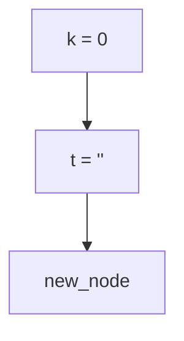

# Algorithm

find the minimum substring in the string

- for each char, add it to a new variable unless it encounters a letter with the same value as first char in substring
- if it encounters a letter with the same value as first char in substring (and then second and on until the length is done)
- add these values to a new variable
- if var1 == var2
  - add +1 to k

